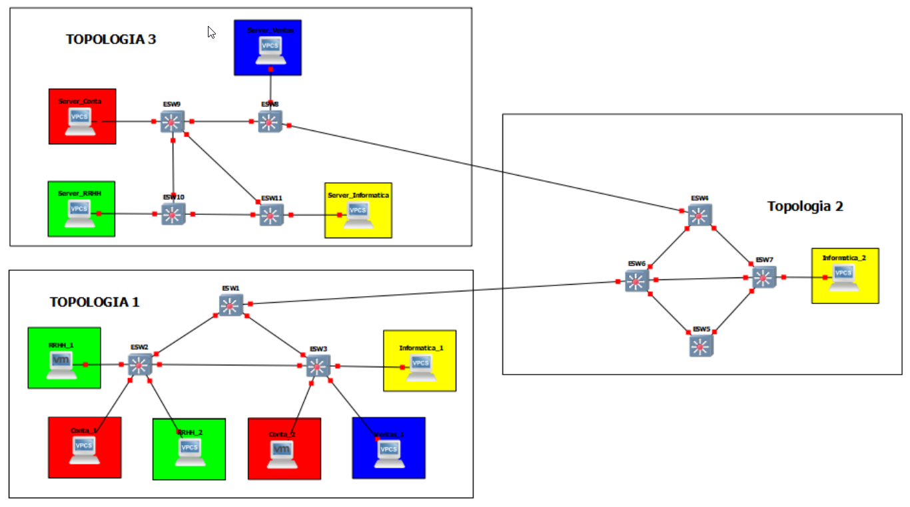
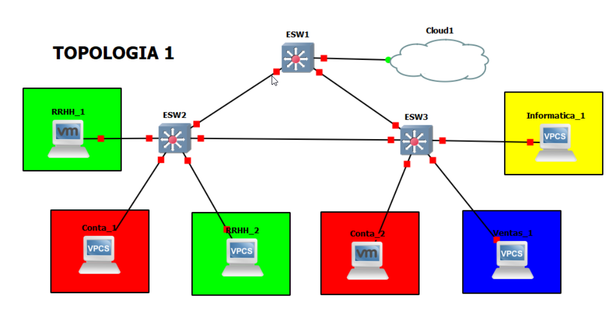
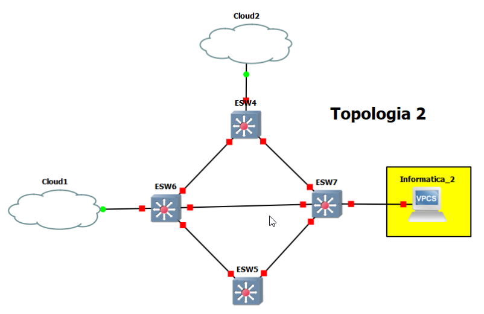
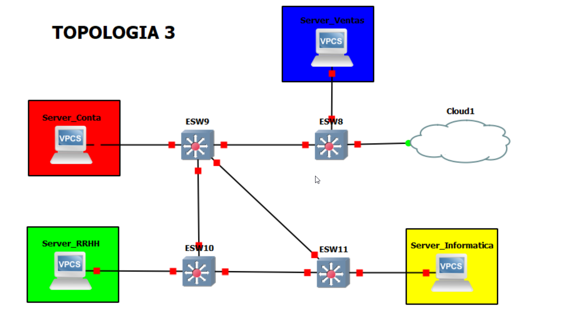

#   Integrantes
-   JAVIER OSWALDO MIRÓN CIFUENTES      201602694
-   WILFRED STEWART PÉREZ SOLORZANO     201408419
-   HECTOR JOSUE OROZCO SALAZAR         201314296

#   Manual de configuracion
##  Red Fisica
Se tendrá de manera física 4 computadoras conectadas a la VPN formando una pequeña
red donde estas tienen conexión y acceso a propiedades de red tradicionales como archivos
compartidos por defecto.


En caso de que algún grupo tenga solo 3 integrantes, la 4ta. computadora deberá ser
una vm en un proveedor de nube. Se aconseja que la vm esté en la misma red y nube que
su vpn.

## Topologia completa
Se debe configurar la siguiente topología, tomando en cuenta estos parámetros iniciales y
los que se detallan a continuación en cada sección de la topología.


<br><br><br>

# Tabla de distribucion IP

| Nombre | No. Vlan|  Direccion de Red | Primera direccion Asignable | Ultima direccion Asignable | Direccion de BroadCast |
|---|---|---|---|---|---|
| RRHH | 18 | 192.168.81.0/24 | 192.168.81.1 | 192.168.81.254 | 192.168.81.255| 
| Informatica | 28 | 192.168.82.0/24 | 192.168.82.1 | 192.168.82.254 | 192.168.82.255| 
| Contabilidad | 38 | 192.168.83.0/24 | 192.168.83.1 | 192.168.83.254 | 192.168.83.255| 
| Ventas | 48 | 192.168.84.0/24 | 192.168.84.1 | 192.168.84.254 | 192.168.84.255| 

<br>
<br>

# Topología 1: Área de Trabajo
Esta zona, corresponde a la sección de cableado horizontal y área de trabajo, donde los
usuarios finales tendrán acceso a los puntos de red y conectar un dispositivo final. La
topografía y características correspondientes de la red es la siguiente:



## Dipositivos 
| Area de Trabajo | Cantidad |
|---|---|
|RRHH|2|
|Informatica|1|
|Contabilidad|2|
|Ventas|1|
|Switch Router|3|
|Cloud|1|

## Configuracion de Areas de trabajo

### Configuracion de Switch 1
``` diff
        configure terminal
        interface fastEthernet fa1/0
        switchport trunk encapsultation dot1q
        switchpot mode trunk
        shutdown
        no shutdown
        exit
        exit

        configure terminal
        interface range fa1/14 -15
        switchport trunk encapsultation dot1q
        switchpot mode trunk
        shutdown
        no shutdown
        exit
        exit

        cofigure terminal
        vtp domain Grupo8
        vtp password Grupo8
        vtp version 2
        vtp mode client
        exit
```
Guardar la configuracion
```txt
    copy running-config startup-config
```
### Configuracion de Switch 2
```txt
        configure terminal
        interface fastEthernet fa1/13
        switchport trunk encapsultation dot1q
        switchpot mode trunk
        shutdown
        no shutdown
        exit
        exit

        configure terminal
        interface fastEthernet fa1/15
        switchport trunk encapsultation dot1q
        switchpot mode trunk
        shutdown
        no shutdown
        exit
        exit

        cofigure terminal
        vtp domain Grupo8
        vtp password Grupo8
        vtp version 2
        vtp mode client
        exit
```
Guardar la configuracion
```txt
    copy running-config startup-config
```
### Configuracion de Switch 3
```txt
        configure terminal
        interface range fa1/13 -14
        switchport trunk encapsultation dot1q
        switchpot mode trunk
        shutdown
        no shutdown
        exit
        exit

        cofigure terminal
        vtp domain Grupo8
        vtp password Grupo8
        vtp version 2
        vtp mode client
        exit
```
Guardar la configuracion
```txt
    copy running-config startup-config
```

### Configuracion de Cloud 1
```txt
    UDP name: UDP Tunnel Topologia 2
    Local port: 4001
    ip host: 10.8.0.4
    Remote port: 4002
```

## Tabla de distribucion de IPs
|Maquina|IP| BroadCast | GateWay |
|---|---|---|---|
|RRHH_1|192.168.81.1|255.255.255.0|192.168.81.254|
|Contabilidad_1|192.168.83.1|255.255.255.0|192.168.83.254|
|RRHH_2|192.168.81.2|255.255.255.0|192.168.81.254|
|Contabilidad_2|192.168.83.2|255.255.255.0|192.168.83.254|
|Ventas_1|192.168.84.1|255.255.255.0|192.168.84.254|
|Informatica_1|192.168.82.1|255.255.255.0|192.168.82.254|

```txt
    ip 192.168.81.1 255.255.255.0 192.168.81.254
```
Guardar configuracion
```txt
    save
```

## Asignacion de VLAN SW 2
```txt
    configure terminal
    interfaces fa1/0
    switchport mode access
    switchport access vlan 18
    exit
    exit

    configure terminal
    interfaces fa1/1
    switchport mode access
    switchport access vlan 38
    exit
    exit

    configure terminal
    interfaces fa1/2
    switchport mode access
    switchport access vlan 18
    exit
    exit
```
Guardar la configuracion
```txt
    copy running-config startup-config
```

## Asignacion de VLAN SW 3
```txt
    configure terminal
    interfaces fa1/1
    switchport mode access
    switchport access vlan 48
    exit
    exit

    configure terminal
    interfaces fa1/2
    switchport mode access
    switchport access vlan 38
    exit
    exit

    configure terminal
    interfaces fa1/3
    switchport mode access
    switchport access vlan 28
    exit
    exit
```
Guardar la configuracion
```txt
    copy running-config startup-config
```


# Topología 2: Backbone
La zona de cableado vertical será la encargada de conectar el área de trabajo con la zona
de servidores, para esto se tiene nodos altamente redundantes cuya finalidad es brindar
una conectividad el 100% del tiempo.


## Dipositivos 
| Area de Trabajo | Cantidad |
|---|---|
|Informatica|1|
|Switch Router|4|
|Cloud|2|

## Configuracion de Areas de trabajo

### Configuracion de Switch cliente 1
```txt
        configure terminal
        interface range fa1/10 - 11 
        switchport trunk encapsultation dot1q
        switchpot mode trunk
        shutdown
        no shutdown
        exit
        exit


        configure terminal
        interfaces fa1/0  
        switchport trunk encapsultation dot1q
        switchpot mode trunk
        shutdown
        no shutdown
        exit
        exit

        cofigure terminal
        vtp domain Grupo8
        vtp password Grupo8
        vtp version 2
        vtp mode server
        exit
```
Guardar la configuracion
```txt
    copy running-config startup-config
```

### Configuracion de Switch cliente 2
```txt
        configure terminal
        interface range fa1/10 - 11 
        switchport trunk encapsultation dot1q
        switchpot mode trunk
        shutdown
        no shutdown
        exit
        exit

        cofigure terminal
        vtp domain Grupo8
        vtp password Grupo8
        vtp version 2
        vtp mode client
        exit
```
Guardar la configuracion
```txt
    copy running-config startup-config
```

### Configuracion de Switch cliente 3
```txt
        configure terminal
        interface range fa1/10 - 12
        switchport trunk encapsultation dot1q
        switchpot mode trunk
        shutdown
        no shutdown
        exit
        exit


        configure terminal
        interfaces fa1/0  
        switchport trunk encapsultation dot1q
        switchpot mode trunk
        shutdown
        no shutdown
        exit
        exit

        cofigure terminal
        vtp domain Grupo8
        vtp password Grupo8
        vtp version 2
        vtp mode client
        exit

```
Guardar la configuracion
```txt
    copy running-config startup-config
```

### Configuracion de Switch clie
```txt
        configure terminal
        interface range fa1/10 - 12 
        switchport trunk encapsultation dot1q
        switchpot mode trunk
        shutdown
        no shutdown
        exit
        exit

        cofigure terminal
        vtp domain Grupo8
        vtp password Grupo8
        vtp version 2
        vtp mode client
        exit
```
Guardar la configuracion
```txt
    copy running-config startup-config
```
Asignacion de VLAN 
```txt
    configure terminal
    interface fa1/0
    switchport mode access
    switchport access vlan 18
    exit
    exit
```
Guardar la configuracion
```txt
    copy running-config startup-config
```


### Configuracion de Cloud 1
```txt
    UDP name: UDP Tunnel Topologia 1
    Local port: 4002
    ip host: 10.8.0.2
    Remote port: 4001
```


### Configuracion de Cloud 2
```txt
    UDP name: UDP Tunnel Topologia 3
    Local port: 4003
    ip host: 10.8.0.3
    Remote port: 4004
```

## Tabla de distribucion de IPs
|Maquina|IP| BroadCast | GateWay |
|---|---|---|---|
|Informatica_2|192.168.82.2|255.255.255.0|192.168.82.254|

```txt
    ip 192.168.82.2 255.255.255.0 192.168.82.254
```
Guardar configuracion
```txt
    save
```


# Topología 3: Zona de Servidores
Lugar donde se almacenan los servidores web de la empresa. Se requiere que los mismos
estén siempre activos, debido a esto la topología se vuelve extremadamente pesada. Por lo
que se usará un nodo maestro-esclavo para equilibrar la carga del mismo.
### Maestro
Con una interfaz gráfica, es quien controla la topología y gestiona los recursos. Es la
huesped de las vpc.
### Esclavo
Un equipo que servirá como host para sobrellevar la carga del maestro.

#### Nota
En este apartado, los servidores web son simples VPC’S, no se debe configurar
nada en ellos más que su dirección ip.



## Dipositivos 
| Area de Trabajo | Cantidad |
|---|---|
|Server RRHH|1|
|Server Informatica|1|
|Server Contabilidad|1|
|Server Ventas|1|
|Switch Router|4|
|Cloud|1|

## Configuracion de Areas de trabajo

### Configuracion de Switch`s cliente
```txt
        configure terminal
        interface range fa
        switchport trunk encapsultation dot1q
        switchpot mode trunk
        shutdown
        no shutdown
        exit
        exit

        cofigure terminal
        vtp domain Grupo8
        vtp password Grupo8
        vtp version 2
        vtp mode client
        exit
```
Guardar la configuracion
```txt
    copy running-config startup-config
```

### Configuracion de Cloud 1
```txt
    UDP name: UDP Tunnel Topologia 2
    Local port: 4004
    ip host: 10.8.0.4
    Remote port: 4003
```

## Tabla de distribucion de IPs
|Maquina|IP| BroadCast | GateWay |
|---|---|---|---|
|Server RRHH |192.168.81.10|255.255.255.0|192.168.81.254|
|Server Contabilidad|192.168.83.10|255.255.255.0|192.168.83.254|
|Server Ventas|192.168.84.10|255.255.255.0|192.168.84.254|
|Server Informatica|192.168.82.10|255.255.255.0|192.168.82.254|

```txt
    ip 192.168.81.10 255.255.255.0 192.168.81.254
```
Guardar configuracion
```txt
    save
```

## Asignacion de VLAN SW 1
```txt
    configure terminal
    interface fa1/15
    switchport mode access
    switchport access vlan 48
    exit
    exit
```
Guardar la configuracion
```txt
    copy running-config startup-config
```

## Asignacion de VLAN SW 2
```txt
    configure terminal
    interface fa1/15
    switchport mode access
    switchport access vlan 38
    exit
    exit
```
Guardar la configuracion
```txt
    copy running-config startup-config
```
## Asignacion de VLAN SW 3
```txt
    configure terminal
    interface fa1/15
    switchport mode access
    switchport access vlan 18
    exit
    exit
```
Guardar la configuracion
```txt
    copy running-config startup-config
```
## Asignacion de VLAN SW 4
```txt
    configure terminal
    interface fa1/15
    switchport mode access
    switchport access vlan 28
    exit
    exit
```
Guardar la configuracion
```txt
    copy running-config startup-config
```

